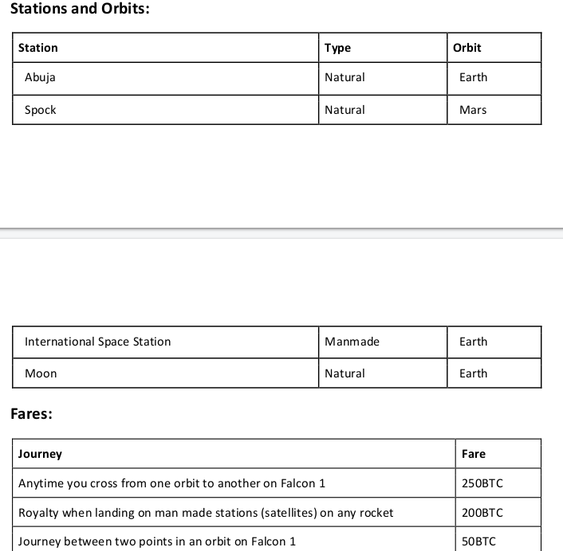

## Question
SpaceX runs a futuristic space travel system within our solar system with payments done	with bitcoin currency (BTC) wallet system.
They have 2 rockets: Falcon1 and falcon9 
You are required to model the following fare wallet system. At the end of the test, you should be able to demonstrat a user loading a wallet	with 3000BTC, and taking the following trips,and then viewing the balance.

The Falcon 9 is a luxury spacecraft with better experience. Its passengers pay twice the fare of the Falcon 1	
  